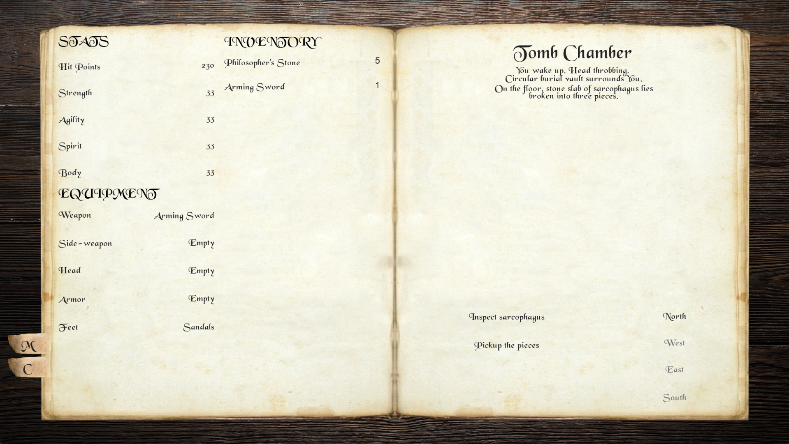
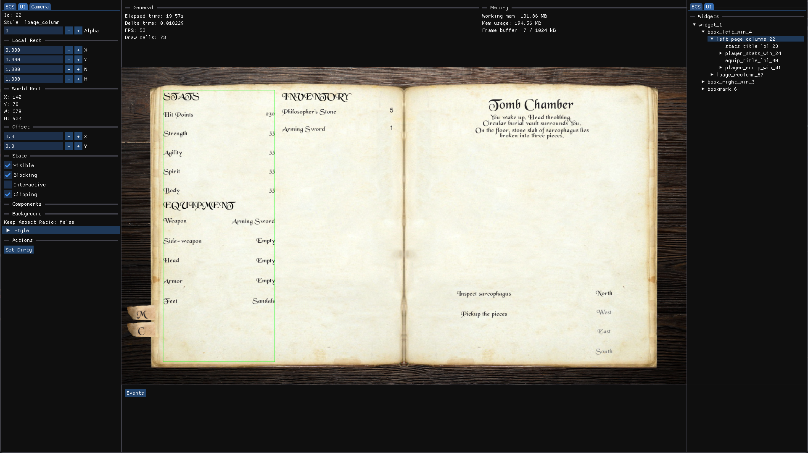
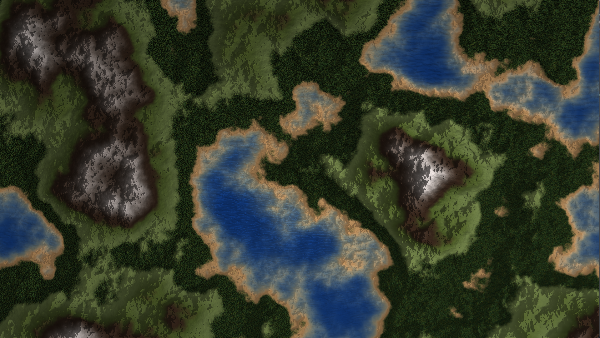
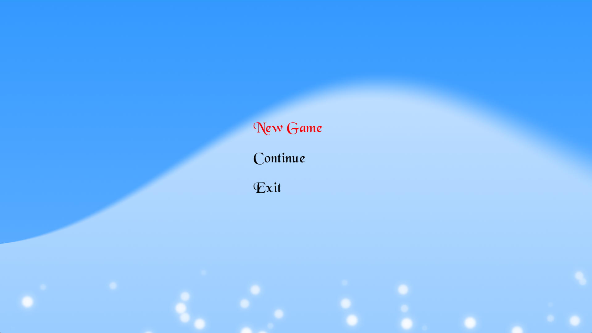

# 2d opengl game
2D game engine build with sdl3 and opengl.

## Screenshots



> A fully text-based game, with all actions taking place through this stylized interface.



> Custom editor built with ImGui, featuring ECS entity listings and a UI tree view.



> Perlin noise heightmap rendered via a custom terrain shader, with adjustable lighting and time-of-day settings.



> Animated background powered by a custom shader (`grad_frag.glsl`), with particle effects and interactive, animated buttons.

# How to build
## Prerequisites

- [CMake](https://cmake.org/download/) 3.21 or newer
- [Ninja](https://ninja-build.org/) build system
- [Git](https://git-scm.com/)

## Setup

### 1. Clone this repository

```powershell
git clone https://github.com/SovernDK/2d-opengl-game
cd my-sdl3-project
```

### 2. Install vcpkg (one-time, machine-wide)

If you don't already have vcpkg installed:

```powershell
git clone https://github.com/microsoft/vcpkg.git C:\vcpkg
C:\vcpkg\bootstrap-vcpkg.bat
```

You can install it anywhere — `C:\vcpkg` is just an example. If you already have vcpkg installed somewhere, skip this step and just note the path.

### 3. Point the project at your vcpkg installation

Choose **one** of the following options.

**Option 1 — Environment variable**

Set `MY_VCPKG_ROOT` to your vcpkg installation path:

```powershell
setx MY_VCPKG_ROOT "C:\vcpkg"
```

Close and reopen your terminal/IDE for it to take effect, then configure with:

```powershell
cmake --preset x64-debug
```

> Note: if you use Visual Studio Developer shells, VS sets its own `VCPKG_ROOT` variable automatically, which can conflict with a manually-set `VCPKG_ROOT`. Using the name `MY_VCPKG_ROOT` avoids this, but if you still run into issues, use Option 2 instead.

**Option 2 — Local override (no env var)**

Create a file named `CMakeUserPresets.json` in the project root (this file is gitignored and personal to your machine):

```json
{
	"version": 3,
	"configurePresets": [
		{
			"name": "x64-debug-local",
			"inherits": "x64-debug",
			"cacheVariables": {
				"CMAKE_TOOLCHAIN_FILE": "C:/vcpkg/scripts/buildsystems/vcpkg.cmake"
			}
		},
		{
			"name": "x64-release-local",
			"inherits": "x64-release",
			"cacheVariables": {
				"CMAKE_TOOLCHAIN_FILE": "C:/vcpkg/scripts/buildsystems/vcpkg.cmake"
			}
		}
	]
}
```

Replace `C:/vcpkg/scripts/buildsystems/vcpkg.cmake` with the actual path to your vcpkg installation (use forward slashes).

Then configure with:

```powershell
cmake --preset x64-debug-local
```

### 4. Build

```powershell
cmake --build --preset x64-debug        # if using Option 1
cmake --build --preset x64-debug-local  # if using Option 2
```

This automatically downloads and builds all dependencies (SDL3, etc.) as listed in `vcpkg.json` — no manual `vcpkg install` step needed. First-time configure may take a few minutes while dependencies compile.

The compiled binary will be in `out/build/x64-debug/` or `out/build/x64-debug-local/` depending on which option you used.

### Available presets

| Preset | Description |
|---|---|
| `x64-debug` / `x64-debug-local` | 64-bit, debug symbols |

---

# API

## ECS
Entity-Component-System which allows use of pure structs as components. 'Child of' relationships are also featured.

### To use ecs system include this header
```cpp
#include "ecs/ecs.h"
```

### Creating new Entity
```cpp
ecs::ECSWorld world;
world->create(); // Creates entity with new ID
world->create("Entity"); // You may also set string handle
```

### Finding entity
```cpp
ecs::ECSWorld world;
auto& e1 = world->entity(12); // Find entity by ID
auto& e2 = world->entity("Entity"); // Find entity by string handle
```
Every entity gets assigned ID from id pool (pool also recycles old ids). 
Id 0 is an empty entity, you can check against it to know that returned entity isn't valid.

### Adding component to entity
```cpp
struct Position { 
	float x = 0;
	float y = 0;
};

struct Actor
{
	std::string name;
}

auto& e = world->create()
				.add<Position>({ 12, 89 })
				.add<Actor>({});
```

#### Enable/Disable Entity
Disabled entities are skipped in systems.
```cpp
ecs::ECSWorld world;
auto& e = world->create();

world->enable(e.id);
world->enable(e);

world->disable(e);
world->disable(e);

e.disable();
e.enable();
```

#### Getting component from entity 
returns pointer to component.
```cpp
struct Position { 
	float x = 0;
	float y = 0;
};

auto& e = world->entity("Entity");
const Position& p1 = e.get<ecs::Position>(); //Read only
Position& p2 = e.getMod<ecs::Position>(); // Mutable
p2->x = 55;
```

### Systems
```cpp
ecs::ECSWorld world;
float deltaTime = getDeltaTime();

// Iterate over EVERY existing entity
world.each([](Entity& e) {
	SDL_Log("Entity Id: %d", e.id);
});

// You can run view (it won't be registered as system) to do something for collection of entities with certain set of components
world->view<Position, Actor>([&](Entity& e, Position& p, Actor& a) 
{
	SDL_Log("View Actor %s", a.name.c_str());
});

// Register new system
world.system<Position, Actor>([&](Entity& e, Position& p, Actor& a) 
{
	SDL_Log("Actor %s is in position (%d, %d)", a.name.c_str(), p.x, p.y);
});

// Run all registered systems
world->process(deltaTime); // You must supply your own deltaTime
```

### Child of relationship
```cppz
auto& parent = world->entity();
auto& child1 = world->create().childOf(parent);
auto& child2 = world->create().childOf(parent.id); // You can also use entity ID

//Iterating over children
for(auto childId : parent.children())
{
	SDL_Log("Child %d", childId);
}
```

### Destroying entities
```cpp
auto& e = world->create();
world->destroy(e);
world->destroy(e.id);
e.destroy();

// Destroy marks entity for deletion (systems will skip it) but to actually clear it from memory you need to run process
world->process(deltaTime);
```

---

## Resources
```cpp
#include "core/resources.h"
```

Shaders and Materials
```cpp
auto handle = "shader";
Resources::loadShader("def_vert.glsl", "def_frag.glsl", handle);
Material def(Resources::getStrPtrShader(handle));
Resources::addSharedMat(handle, std::make_shared<Material>(def));
```

Textures
```cpp
Resources::loadTexture(file_util::createPath("assets", "default.png").string(),	"default");
auto* texture = Resources::texture("default");
```

Sounds and Music
```cpp
Resources::loadClip(file_util::createPath("assets", "sfx", "ui_move.wav").string(), "clip");
Resources::loadMusic(file_util::createPath("assets", "music", "music.wav").string(), "music");
```

TTF Fonts
```cpp
Resources::loadTTFont(path, fontSize);
auto* font = Resources::font("default")->size(fontSize);
```

---

## Renderer
Renderer uses the opengl API for communication with GPU. Through render queue commands are passed to the renderer which then translates it to opengl api commands.
In future option to use DirectX may be added.

### Include
```cpp
	#include "graphics/rendering/canvas_2d.h"
```

### Frame Memory Buffer
Simple memory arena which allows to allocate space for object for a time-span of a frame.
Amount of memory accessible is defined in Application layer at initialization (default - 1 Mb).
There is no system for expanding the pool so be careful to not overflow.

Since logic is simple and we are using single block of contigous memory its faster then using malloc ('new')

```cpp
	Mesh* mesh = loadToArena<Mesh>();
	Mesh* mesh = loadToArena<Mesh>({ .verticies = ... }); // You can initialize with arguments
```

### Material Instance
Material instance stores pointer to shader program and map of textures and properties which will be passed to the shader.
```cpp
	#include "graphics/material.h"
```

### Drawing Sprites
Include base components.
Sprite stores rendering data (texture, size, material).
Transform2D stores position, rotation and scale

```cpp
	#include "ecs/base_components.h"

	ecs::Sprite* sprite = loadToArena<ecs::Sprite>();
	ecs::Transform2D* transform = loadToArena<ecs::Transform2D>();
```

Draw Sprite
```cpp
	Canvas2D::drawSprite(sprite, transform);
```

### Draw Image
Draw texture on quad of supplied bounds.

```cpp
	TexID textureId = Resources::texture("default")->id;
	glm::vec4 rect = { 0, 0, 1920, 1080 };
	UVRect uvs{}; // This sets default stretching

	Canvas2D::drawImage(textureId, rect, uvs);
```

### Draw Quad
Draw quad simple quad using dimensions and material instance

```cpp
	auto* material = Canvas2D::loadToArena<MaterialInstance>(Resources::sharedMat("ui"));
	material->setProperty("mainColor", glm::vec3(0.0f));

	glm::vec4 rect{ 0.0f, 0.0f, 128.0f, 128.0f };

	Canvas2D::drawQuad(rect, material);
```

### Draw Text
```cpp
	auto text = "Lorem ipsum";
	auto font = "Arial";
	int fontSize = 32;
	ecs::Transform2D transform{ .position{ 100, 100 } };

	Canvas2D::drawText(text, transform, font, fontSize);
```

Text size
```cpp
	Canvas2D::textSize(text, font, fontSize); // Returns vector where x is a width of text and y is it's height
```

### Internal revolution
Sets resolution within which everything will be rendered and then upscaled to the screen resolution.
This way shaders work on smaller textures, making it more performant but graphics quality takes a hit.
```cpp
	Canvas2D::setInternalResolution(1024, 720);
```

### Modifiers
Set Depth - determines drawing order
```cpp
	Canvas2D::setDepth(22);
```

Set Color - sets uniform 'main color' of a shader (usage determined by specific shader)
```cpp
	SDL_Color color = {255, 0, 0, 255};
	Canvas2D::setColor(color);
```

Set Blend - sets blend mode
- Alpha
- None
- Additive
```cpp
	BlendMode blendMode = BlendMode::Alpha;
	Canvas2D::setBlend(blendMode);
```

Clipping - enables clipping and sets boundary, everything rendered after this will reject all pixels outside of set boundary
```cpp
	Canvas2D::setIsClipping(true);
	Canvas2D::setClipping(glm::vec4{ 126, 126, 256, 312 });
```

Reset modifiers to default
```cpp
	Canvas2D::reset();
```

---

## Retained-mode UI

### Style
Within style.json you can define properties of ui widgets which can be set with .setStyle(...).
```cpp
"my_button": {
		"background": {
			"color": "#000000",
			"hoverColor": "#ffffff"
		},

		"text": {
			"font": "Canterbury",
			"size": 48,
			"color": "#000000",
			"hoverColor": "#ffffff",
			"align": "middle"
		}
	}
```

You can also set layout strategy for children of Widget
```cpp
"my_window": {
		"childrenOrigin": "center",
		"verticalLayout": {
			"expand": "both",
			"fit": true,
			"margin": {
				"left": 6,
				"top": 6,
				"right": 6,
				"bottom": 6
			},
			"spacing": 10
		},

		"background": {
			"color": "#000000",
			"hoverColor": "#000000"
		}
	}
```

### Include
```cpp
#include "services/ui_service.h"
```

### Building UI
```cpp
auto ui = ServiceLocator::get<IUIService>();
```

Every widget can set Local position, local size and pivot.
Local position and size are normalized value bewteen 0.0 - 1.0 which set size and position relative to parent.
Pivot is also normalized within widget, it determines widget's origin.

```cpp
auto window = ui->createWidget()
				.setLocPos(0.1f, 0.1f) // Can also use enum UIAnchor
				.setLocSize(0.5f, 0.3f)
				.setPivot(UIAnchor::Center)
```

#### Window
```cpp
auto window = ui->createWindow()
		.setLocPos(UIAnchor::Center)
		.setLocSize(0.5f, 0.3f)
		.setPivot(UIAnchor::Center)
		.setStyle("def_window") // If not supplied default will be used
		.setAlpha(255)			// 0 - 255
		.build("my_window");
```

#### Button
```cpp
TexID background;
std::string text = "Lorem Ipsum";

auto button = ui->createButton()
		.setLocPos(UIAnchor::Center)
		.setLocSize(0.5f, 0.3f)
		.setPivot(UIAnchor::Center)
		.setStyle("def_button") // If not supplied default will be used
		.setAlpha(255)			// 0 - 255
		.setText(text)			// Button text
		.setImage(background)   // Button background
		.build("my_button");
```

#### Label
```cpp
std::string text = "Lorem Ipsum";

auto button = ui->createLabel()
		.setLocPos(UIAnchor::Center)
		.setLocSize(0.5f, 0.3f)
		.setPivot(UIAnchor::Center)
		.setStyle("def_label") // If not supplied default will be used
		.setAlpha(255)			// 0 - 255
		.setText(text)			// Button text
		.build("my_label");
```

#### Parent - Child
```cpp
auto choices = ui->createWindow()
	.setStyle("page_window")
	.setParent(rightPage)
	.setAlpha(255)
	.build("right_page_choices");

auto choice1 = ui->createButton()
	.setStyle("choice_button")
	.setParent(choices) // Set parent
	.setText("Lorem ipsum dolor sit amet")
	.setAlpha(255)
	.build("choice1");

auto choice2 = ui->createButton()
	.setStyle("choice_button")
	.setParent(choices) // Set parent
	.setText("Quisque et condimentum augue")
	.setAlpha(255)
	.build("choice2");

auto choice3 = ui->createButton()
	.setStyle("choice_button")
	.setParent(choices) // Set parent
	.setText("Gallia est omnis divisas in partes tres")
	.setAlpha(255)
	.build("choice3");
```

#### Widget's Animations
Every animation is put into queue in the order it was called in. Animations are played one after another.
For simultaneous animations on one widget use CombinedAnimation(WIP).

```cpp
 // Fade in alpha from 0 to 255 over 1.5 second.
button->play<FadeIn>(1.5f);

/* Callbacks:
Listener::START, 
Listener::UPDATE, 
Listener::EXIT
You can add multiple callbacks to every Listener type.
*/
button->play<FadeIn>(1.5f)->addListener(Listener::EXIT, [&]() { /* Do something at the end of animation */ });

// Set easing curve which will be used for animation
button->play<FadeIn>(1.5f)->setCurve<feel::QuadCurve>(feel::EasingType::In);

```

---